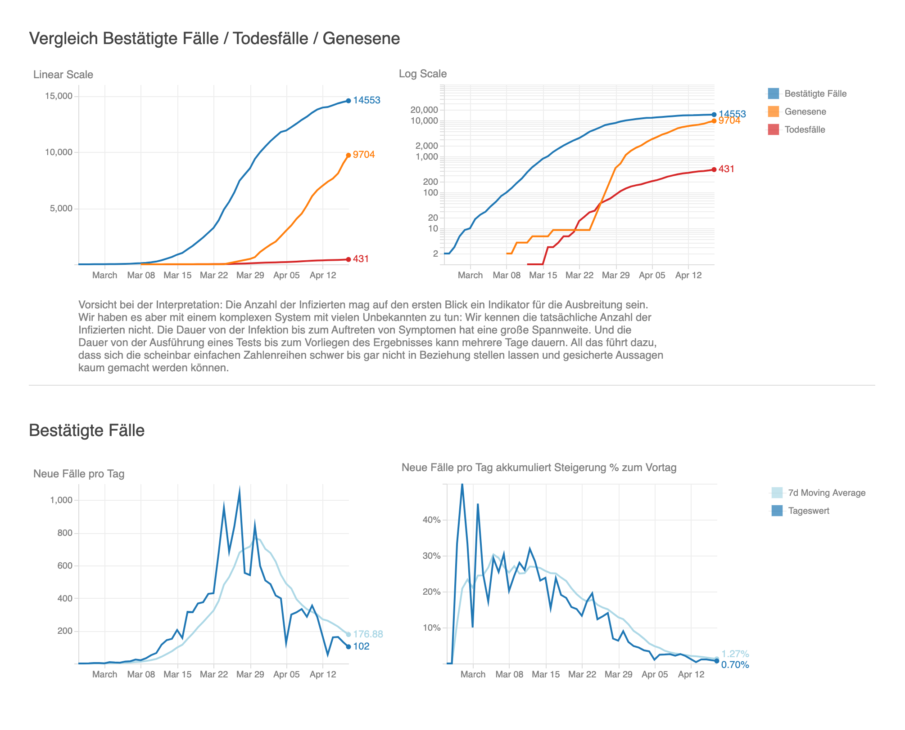
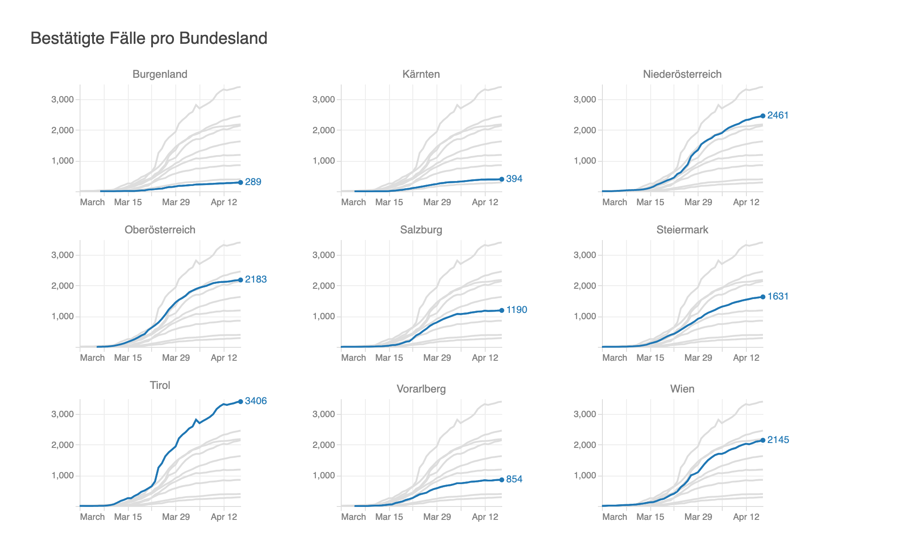

# covid-19
COVID-19 data exploration with a focus on Austria.

Visit the website with chart renderings here: https://walterra.github.io/covid-19/

 

The code that creates the VEGA specifications for the charts can be found in this Jupyter Notebook: https://github.com/walterra/covid-19/blob/master/jupyter/covid19-at.ipynb

# development

To run and edit the Jupyter Notebook:

```bash
jupyter notebook
```

To get the latest data, run the jupyter notebook in headless mode and update the VEGA specs:

```bash
npm run all
```

----

The web page (`index.html`) uses `vega-embed` to display the charts. To make them work in IE11, rollup+babel is used to transpile the original vega code.

```bash
# for development without minification but a file watcher
npm run dev

# to create the final build
npm run build

# to just start a web server without triggering any build process
npm run start
```
